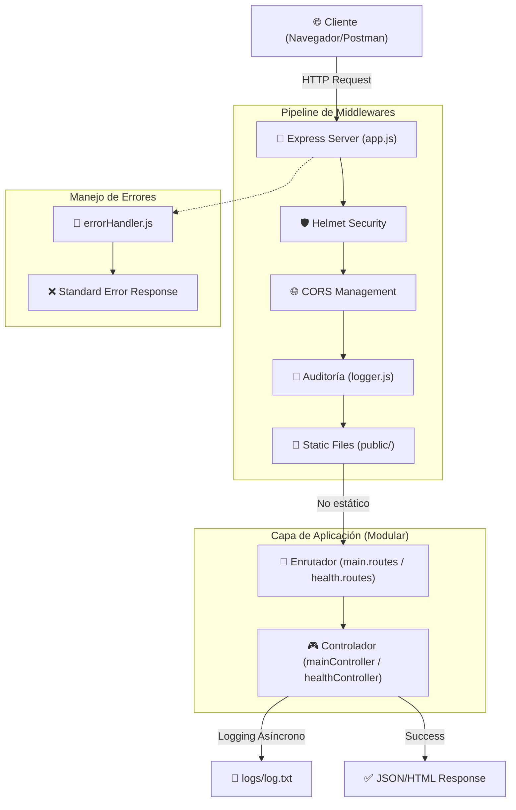

# Arquitectura del Sistema - Alke Wallet (M6)

Este documento describe la arquitectura técnica y el flujo de datos de la implementación inicial del backend para Alke Wallet, diseñada bajo estándares de **Enterprise Solutions Architect**.

## 🏗️ Esquema de la Arquitectura

## 📐 Principios de Diseño

1. **Patrón MVC (Model-View-Controller)**: Aunque en esta fase inicial no hay base de datos, la estructura ya separa las **Rutas** de la **Lógica de Negocio (Controladores)**.
2. **Modularidad**: Cada componente (ruta, controlador, middleware) reside en su propio archivo, facilitando el mantenimiento y el escalado hacia el Módulo 7 (Sequelize).
3. **Escalabilidad Horizontal**: Al separar `app.js` de la lógica de escucha del servidor, el sistema está preparado para ser testeado e integrado en contenedores o arquitecturas de microservicios.
4. **Seguridad Proactiva**: Integración nativa de `helmet` para protección de cabeceras y un manejador de errores centralizado que evita fugas de información técnica (*stack traces*) en producción.

## 📦 Gestión de Entorno
- **Gestor de Paquetes**: `pnpm` (Eficiencia y seguridad de dependencias).
- **Inyección de Dependencias**: Uso de `dotenv` para configuración desacoplada del código fuente.

## 📁 Estructura de Directorios
- `src/app.js`: Corazón de la configuración.
- `src/routes/`: Definición de contratos de la API.
- `src/controllers/`: Implementación de la lógica funcional.
- `src/middlewares/`: Guardianes y auditores del flujo de datos.
- `src/public/`: Entrega de activos estáticos con identidad visual corporativa.
